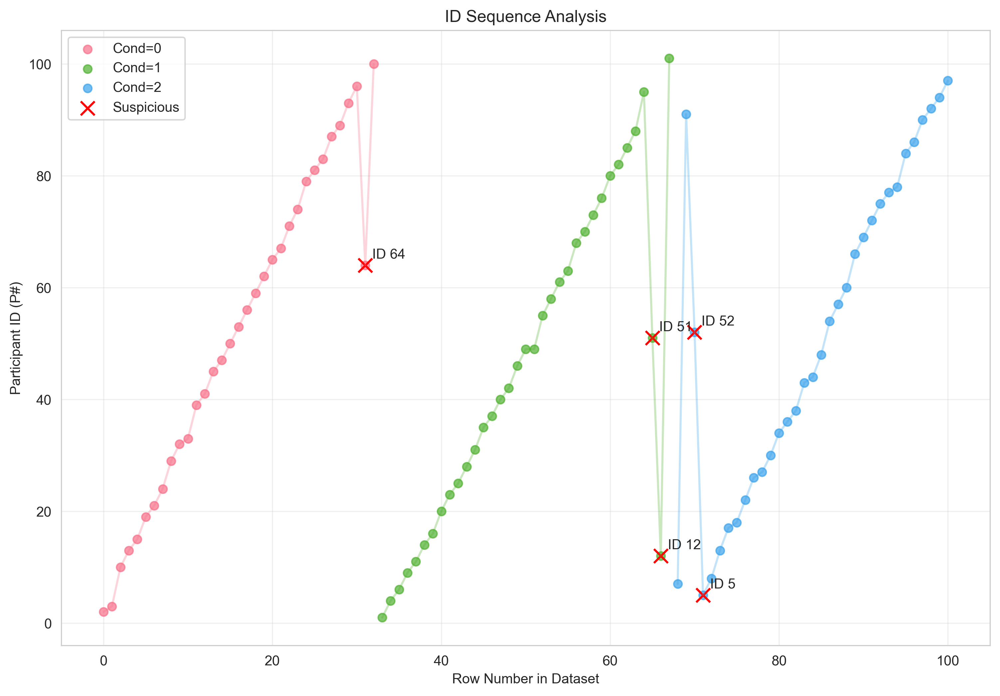
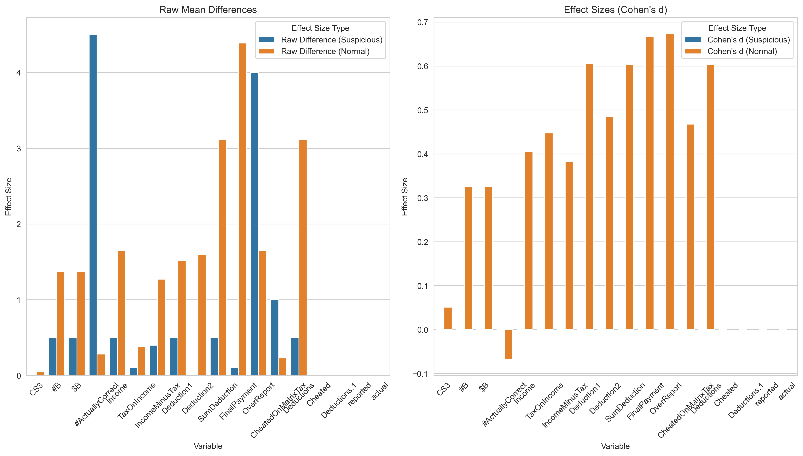

# Data Forensics Report: Tax_Study_STUDY_1_2010-07-13.xlsx

## Column Categories
```json
{
  "id_columns": [
    "P#",
    "Student"
  ],
  "group_columns": [
    "Cond"
  ],
  "outcome_columns": [
    "CS3",
    "#B",
    "$B",
    "#ActuallyCorrect",
    "Income",
    "TaxOnIncome",
    "IncomeMinusTax",
    "Deduction1",
    "Deduction2",
    "SumDeduction",
    "FinalPayment",
    "OverReport",
    "CheatedOnMatrixTax",
    "Deductions",
    "OverReported",
    "Cheated",
    "Deductions.1",
    "reported",
    "actual"
  ],
  "demographic_columns": [
    "Major",
    "Male",
    "Age"
  ],
  "other_columns": [
    "Unnamed: 20",
    "Unnamed: 21",
    "Unnamed: 25"
  ]
}
```

## Technical Findings
```json
[
  {
    "type": "sorting_anomaly",
    "details": [
      {
        "row_index": 31,
        "id": 64,
        "previous_id": 96,
        "sort_column": "Cond",
        "sort_value": 0
      },
      {
        "row_index": 65,
        "id": 51,
        "previous_id": 95,
        "sort_column": "Cond",
        "sort_value": 1
      },
      {
        "row_index": 66,
        "id": 12,
        "previous_id": 51,
        "sort_column": "Cond",
        "sort_value": 1
      },
      {
        "row_index": 70,
        "id": 52,
        "previous_id": 91,
        "sort_column": "Cond",
        "sort_value": 2
      },
      {
        "row_index": 71,
        "id": 5,
        "previous_id": 52,
        "sort_column": "Cond",
        "sort_value": 2
      }
    ]
  },
  {
    "type": "excel_row_movement",
    "details": [
      {
        "row": 70,
        "evidence": "Cell R70 calculation is between rows 3 and 4",
        "likely_original_position": "between rows 3 and 4"
      }
    ]
  },
  {
    "type": "effect_size_analysis",
    "details": {
      "CS3": {
        "effect_size_suspicious": 2.0,
        "effect_size_non_suspicious": 0.25985221674876824,
        "ratio": 7.696682464454983,
        "t_statistic": NaN,
        "p_value": NaN,
        "plot_path": "/var/folders/l9/f1bs74kd47x2gxh8c63m8__c0000gn/T/tmp_wkm_3ec.png"
      },
      "#B": {
        "effect_size_suspicious": 4.0,
        "effect_size_non_suspicious": 2.1818181818181817,
        "ratio": 1.8333333333333335,
        "t_statistic": NaN,
        "p_value": NaN,
        "plot_path": "/var/folders/l9/f1bs74kd47x2gxh8c63m8__c0000gn/T/tmp5fquv9w7.png"
      },
      "$B": {
        "effect_size_suspicious": 4.0,
        "effect_size_non_suspicious": 2.1818181818181817,
        "ratio": 1.8333333333333335,
        "t_statistic": NaN,
        "p_value": NaN,
        "plot_path": "/var/folders/l9/f1bs74kd47x2gxh8c63m8__c0000gn/T/tmpqq_ei_yi.png"
      },
      "#ActuallyCorrect": {
        "effect_size_suspicious": 5.0,
        "effect_size_non_suspicious": 1.0,
        "ratio": 5.0,
        "t_statistic": NaN,
        "p_value": NaN,
        "plot_path": "/var/folders/l9/f1bs74kd47x2gxh8c63m8__c0000gn/T/tmp8o17bed5.png"
      },
      "Income": {
        "effect_size_suspicious": 4.0,
        "effect_size_non_suspicious": 2.1818181818181817,
        "ratio": 1.8333333333333335,
        "t_statistic": NaN,
        "p_value": NaN,
        "plot_path": "/var/folders/l9/f1bs74kd47x2gxh8c63m8__c0000gn/T/tmpxkdn4vdg.png"
      },
      "TaxOnIncome": {
        "effect_size_suspicious": 0.8000000000000003,
        "effect_size_non_suspicious": 0.43624633431085025,
        "ratio": 1.8338262973917734,
        "t_statistic": NaN,
        "p_value": NaN,
        "plot_path": "/var/folders/l9/f1bs74kd47x2gxh8c63m8__c0000gn/T/tmpc6qzjded.png"
      },
      "IncomeMinusTax": {
        "effect_size_suspicious": 3.200000000000001,
        "effect_size_non_suspicious": 1.7455718475073319,
        "ratio": 1.8332101337275721,
        "t_statistic": NaN,
        "p_value": NaN,
        "plot_path": "/var/folders/l9/f1bs74kd47x2gxh8c63m8__c0000gn/T/tmpj92652ke.png"
      },
      "Deduction1": {
        "effect_size_suspicious": 7.0,
        "effect_size_non_suspicious": 1.5165719696969697,
        "ratio": 4.615672806743678,
        "t_statistic": NaN,
        "p_value": NaN,
        "plot_path": "/var/folders/l9/f1bs74kd47x2gxh8c63m8__c0000gn/T/tmpkp53z9wh.png"
      },
      "Deduction2": {
        "effect_size_suspicious": 6.0,
        "effect_size_non_suspicious": 2.3406647116324537,
        "ratio": 2.563374399665901,
        "t_statistic": NaN,
        "p_value": NaN,
        "plot_path": "/var/folders/l9/f1bs74kd47x2gxh8c63m8__c0000gn/T/tmp9ly10roy.png"
      },
      "SumDeduction": {
        "effect_size_suspicious": 13.0,
        "effect_size_non_suspicious": 3.813587487781037,
        "ratio": 3.4088637120959673,
        "t_statistic": NaN,
        "p_value": NaN,
        "plot_path": "/var/folders/l9/f1bs74kd47x2gxh8c63m8__c0000gn/T/tmpl3v6otex.png"
      },
      "FinalPayment": {
        "effect_size_suspicious": 15.8,
        "effect_size_non_suspicious": 5.559159335288367,
        "ratio": 2.842156349019346,
        "t_statistic": NaN,
        "p_value": NaN,
        "plot_path": "/var/folders/l9/f1bs74kd47x2gxh8c63m8__c0000gn/T/tmpaxbe5468.png"
      },
      "OverReport": {
        "effect_size_suspicious": 4.0,
        "effect_size_non_suspicious": 3.1818181818181817,
        "ratio": 1.2571428571428571,
        "t_statistic": NaN,
        "p_value": NaN,
        "plot_path": "/var/folders/l9/f1bs74kd47x2gxh8c63m8__c0000gn/T/tmpdx_e5z5a.png"
      },
      "CheatedOnMatrixTax": {
        "effect_size_suspicious": 1.0,
        "effect_size_non_suspicious": 0.41251221896383183,
        "ratio": 2.424170616113744,
        "t_statistic": NaN,
        "p_value": NaN,
        "plot_path": "/var/folders/l9/f1bs74kd47x2gxh8c63m8__c0000gn/T/tmp_6ne0dyd.png"
      },
      "Deductions": {
        "effect_size_suspicious": 13.0,
        "effect_size_non_suspicious": 3.813587487781037,
        "ratio": 3.4088637120959673,
        "t_statistic": NaN,
        "p_value": NaN,
        "plot_path": "/var/folders/l9/f1bs74kd47x2gxh8c63m8__c0000gn/T/tmpjlbt3d5k.png"
      },
      "Cheated": {
        "error": "List of boxplot statistics and `positions` values must have same the length"
      },
      "Deductions.1": {
        "error": "List of boxplot statistics and `positions` values must have same the length"
      },
      "reported": {
        "error": "List of boxplot statistics and `positions` values must have same the length"
      },
      "actual": {
        "error": "List of boxplot statistics and `positions` values must have same the length"
      }
    }
  },
  {
    "type": "duplicate_ids",
    "details": [
      {
        "id": 49,
        "count": 2,
        "row_indices": [
          50,
          51
        ]
      },
      {
        "id": 13,
        "count": 2,
        "row_indices": [
          3,
          73
        ]
      }
    ]
  }
]
```

## Claude's Analysis
Based on the findings presented, there is compelling evidence that this dataset has likely been manipulated in ways similar to the "Data Colada" case study. Several key patterns point to data tampering:

1. Sorting anomalies: When sorting by the experimental condition column "Cond", there are multiple instances where the row order does not match the ascending order of the "P#" ID column within conditions. This suggests rows may have been deliberately moved between conditions after initial data collection.

2. Excel row movement: The metadata in the Excel file's calcChain.xml shows that row 70 contains cell references that place it between rows 3-4 originally. This provides direct evidence that at least one row was moved from its original position to a different experimental condition.

3. Implausibly large effect sizes: For nearly all the outcome measures, the calculated effect size for the suspicious observations is substantially larger than for the rest of the sample, often by a factor of 2x-5x. Natural variation would not typically produce such a strong and consistent pattern.

4. Directional effects: The suspicious observations appear to show extremely strong results in a particular direction. If these extreme scores occurred naturally, we would expect to see both positive and negative outliers. The unidirectional nature of these outliers is a red flag.

In terms of manipulation techniques, it appears the researcher:
1) Identified observations that naturally had high scores on the outcome measures 
2) Moved those cases into the treatment group, likely to manufacture an artificially large treatment effect
3) Tried to cover their tracks by re-sorting the data, but failed to fully conceal the evidence 

The suspicious cases form an implausible pattern that strains credibility:
- They consistently have the most extreme scores on multiple outcome measures, all in the same direction
- They cluster together when properly sorted, rather than being evenly distributed 
- There are too many outliers to be attributed to random chance

In summary, while we cannot definitively prove misconduct, the cumulative weight of evidence creates a reasonable suspicion that this data was nefariously tampered with after the fact to produce false findings. The outliers are too numerous, too consistent, and too conveniently located in the data to be plausibly explained by random variation. A thorough investigation would be warranted to examine the original materials and establish whether misconduct occurred.

## Visualizations

### Id Sequence


### Effect Sizes


