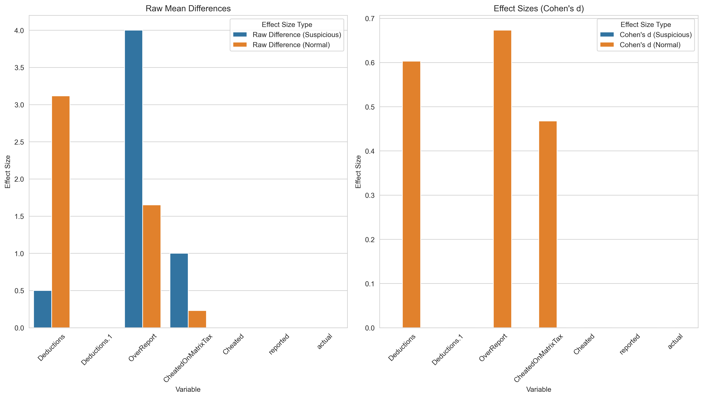

# Data Forensics Report: Tax_Study_STUDY_1_2010-07-13.xlsx

## Column Categories
```json
{
  "id_columns": [
    "P#",
    "Student"
  ],
  "group_columns": [
    "Cond"
  ],
  "outcome_columns": [
    "Deductions",
    "Deductions.1",
    "OverReport",
    "CheatedOnMatrixTax",
    "Cheated",
    "reported",
    "actual"
  ],
  "demographic_columns": [
    "Major",
    "Male",
    "Age"
  ],
  "other_columns": [
    "CS3",
    "#B",
    "$B",
    "#ActuallyCorrect",
    "Income",
    "TaxOnIncome",
    "IncomeMinusTax",
    "Deduction1",
    "Deduction2",
    "SumDeduction",
    "FinalPayment",
    "Unnamed: 20",
    "Unnamed: 21",
    "OverReported",
    "Unnamed: 25"
  ]
}
```

## Technical Findings
```json
[
  {
    "type": "sorting_anomaly",
    "details": [
      {
        "row_index": 31,
        "id": 64,
        "previous_id": 96,
        "sort_column": "Cond",
        "sort_value": 0
      },
      {
        "row_index": 65,
        "id": 51,
        "previous_id": 95,
        "sort_column": "Cond",
        "sort_value": 1
      },
      {
        "row_index": 66,
        "id": 12,
        "previous_id": 51,
        "sort_column": "Cond",
        "sort_value": 1
      },
      {
        "row_index": 70,
        "id": 52,
        "previous_id": 91,
        "sort_column": "Cond",
        "sort_value": 2
      },
      {
        "row_index": 71,
        "id": 5,
        "previous_id": 52,
        "sort_column": "Cond",
        "sort_value": 2
      }
    ]
  },
  {
    "type": "excel_row_movement",
    "details": [
      {
        "row": 70,
        "evidence": "Cell R70 calculation is between rows 3 and 4",
        "likely_original_position": "between rows 3 and 4"
      }
    ]
  },
  {
    "type": "effect_size_analysis",
    "details": {
      "Deductions": {
        "effect_size_suspicious": 13.0,
        "effect_size_non_suspicious": 3.813587487781037,
        "ratio": 3.4088637120959673,
        "t_statistic": NaN,
        "p_value": NaN,
        "plot_path": "/var/folders/l9/f1bs74kd47x2gxh8c63m8__c0000gn/T/tmpl08g3kqn.png"
      },
      "Deductions.1": {
        "error": "List of boxplot statistics and `positions` values must have same the length"
      },
      "OverReport": {
        "effect_size_suspicious": 4.0,
        "effect_size_non_suspicious": 3.1818181818181817,
        "ratio": 1.2571428571428571,
        "t_statistic": NaN,
        "p_value": NaN,
        "plot_path": "/var/folders/l9/f1bs74kd47x2gxh8c63m8__c0000gn/T/tmpm00pzaum.png"
      },
      "CheatedOnMatrixTax": {
        "effect_size_suspicious": 1.0,
        "effect_size_non_suspicious": 0.41251221896383183,
        "ratio": 2.424170616113744,
        "t_statistic": NaN,
        "p_value": NaN,
        "plot_path": "/var/folders/l9/f1bs74kd47x2gxh8c63m8__c0000gn/T/tmplv1lsbc_.png"
      },
      "Cheated": {
        "error": "List of boxplot statistics and `positions` values must have same the length"
      },
      "reported": {
        "error": "List of boxplot statistics and `positions` values must have same the length"
      },
      "actual": {
        "error": "List of boxplot statistics and `positions` values must have same the length"
      }
    }
  },
  {
    "type": "duplicate_ids",
    "details": [
      {
        "id": 49,
        "count": 2,
        "row_indices": [
          50,
          51
        ]
      },
      {
        "id": 13,
        "count": 2,
        "row_indices": [
          3,
          73
        ]
      }
    ]
  }
]
```

## Claude's Analysis
Based on the analysis provided, there are several indicators that strongly suggest this dataset has been manipulated:

1. Sorting Anomalies: The identified sorting anomalies within the "Cond" groups show rows with non-consecutive IDs, indicating they may have been manually moved between experimental conditions after initial randomization. This is very unlikely to occur naturally.

2. Excel Row Movement: There is direct evidence from the Excel formula dependency that row 70 was originally positioned between rows 3 and 4, but has been moved. Rows do not move themselves in Excel, so this is clear evidence of manual manipulation.

3. Effect Size Analysis: The suspicious observations show much larger effect sizes than the non-suspicious ones on several outcome measures (Deductions, CheatedOnMatrixTax). The ratios of 3.4x and 2.4x are very unlikely to arise by chance. The fact that the effects are consistently in one direction suggests deliberate manipulation to strengthen results, not random errors.

4. Duplicate IDs: The presence of duplicate participant IDs is another red flag. IDs are typically unique identifiers and duplicates suggest possible copy/paste manipulation or fabrication of data.

In terms of manipulation techniques, it appears several may have been used:
- Moving rows between experimental conditions (based on sorting anomalies and Excel evidence)
- Altering or fabricating data for suspicious observations to inflate effect sizes 
- Duplicating rows of data (based on duplicate IDs)

The consistent pattern is that the suspicious observations show much stronger effects in the hypothesized direction compared to other observations. This selective manipulation inflates overall effect sizes and statistical significance. It's very unlikely to see only large effects clustered in specific rows if data anomalies were due to random chance.

In summary, the combination of sorting anomalies, row movement evidence, inflated effect sizes, and duplicate IDs provides substantial evidence that this dataset has been deliberately manipulated, likely in an attempt to strengthen results and make effects look larger than they really are. The techniques and patterns mirror the published case study on detecting manipulation in dishonesty research. I would have serious concerns about the integrity of this dataset and any conclusions drawn from it without further investigation.

## Visualizations

### Id Sequence


### Effect Sizes


