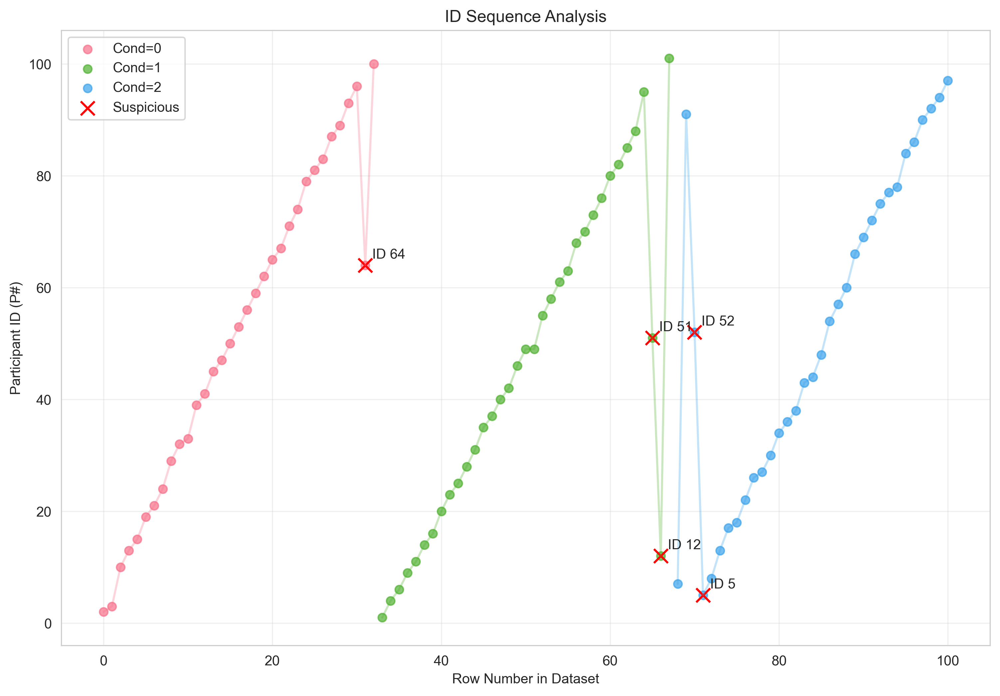
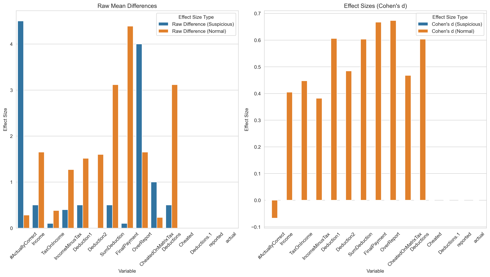

# Data Forensics Report: Tax_Study_STUDY_1_2010-07-13.xlsx

## Column Categories
```json
{
  "id_columns": [
    "P#",
    "Student"
  ],
  "group_columns": [
    "Cond"
  ],
  "outcome_columns": [
    "#ActuallyCorrect",
    "Income",
    "TaxOnIncome",
    "IncomeMinusTax",
    "Deduction1",
    "Deduction2",
    "SumDeduction",
    "FinalPayment",
    "OverReport",
    "CheatedOnMatrixTax",
    "Deductions",
    "Cheated",
    "Deductions.1",
    "reported",
    "actual"
  ],
  "demographic_columns": [
    "Major",
    "Male",
    "Age"
  ],
  "other_columns": [
    "CS3",
    "#B",
    "$B",
    "Unnamed: 20",
    "Unnamed: 21",
    "OverReported",
    "Unnamed: 25"
  ]
}
```

## Technical Findings
```json
[
  {
    "type": "sorting_anomaly",
    "details": [
      {
        "row_index": 31,
        "id": 64,
        "previous_id": 96,
        "sort_column": "Cond",
        "sort_value": 0
      },
      {
        "row_index": 65,
        "id": 51,
        "previous_id": 95,
        "sort_column": "Cond",
        "sort_value": 1
      },
      {
        "row_index": 66,
        "id": 12,
        "previous_id": 51,
        "sort_column": "Cond",
        "sort_value": 1
      },
      {
        "row_index": 70,
        "id": 52,
        "previous_id": 91,
        "sort_column": "Cond",
        "sort_value": 2
      },
      {
        "row_index": 71,
        "id": 5,
        "previous_id": 52,
        "sort_column": "Cond",
        "sort_value": 2
      }
    ]
  },
  {
    "type": "excel_row_movement",
    "details": [
      {
        "row": 70,
        "evidence": "Cell R70 calculation is between rows 3 and 4",
        "likely_original_position": "between rows 3 and 4"
      }
    ]
  },
  {
    "type": "effect_size_analysis",
    "details": {
      "#ActuallyCorrect": {
        "effect_size_suspicious": 5.0,
        "effect_size_non_suspicious": 1.0,
        "ratio": 5.0,
        "t_statistic": NaN,
        "p_value": NaN,
        "plot_path": "/var/folders/l9/f1bs74kd47x2gxh8c63m8__c0000gn/T/tmp6871ngn2.png"
      },
      "Income": {
        "effect_size_suspicious": 4.0,
        "effect_size_non_suspicious": 2.1818181818181817,
        "ratio": 1.8333333333333335,
        "t_statistic": NaN,
        "p_value": NaN,
        "plot_path": "/var/folders/l9/f1bs74kd47x2gxh8c63m8__c0000gn/T/tmp5ui0hpco.png"
      },
      "TaxOnIncome": {
        "effect_size_suspicious": 0.8000000000000003,
        "effect_size_non_suspicious": 0.43624633431085025,
        "ratio": 1.8338262973917734,
        "t_statistic": NaN,
        "p_value": NaN,
        "plot_path": "/var/folders/l9/f1bs74kd47x2gxh8c63m8__c0000gn/T/tmps72dc94c.png"
      },
      "IncomeMinusTax": {
        "effect_size_suspicious": 3.200000000000001,
        "effect_size_non_suspicious": 1.7455718475073319,
        "ratio": 1.8332101337275721,
        "t_statistic": NaN,
        "p_value": NaN,
        "plot_path": "/var/folders/l9/f1bs74kd47x2gxh8c63m8__c0000gn/T/tmpauelpzcc.png"
      },
      "Deduction1": {
        "effect_size_suspicious": 7.0,
        "effect_size_non_suspicious": 1.5165719696969697,
        "ratio": 4.615672806743678,
        "t_statistic": NaN,
        "p_value": NaN,
        "plot_path": "/var/folders/l9/f1bs74kd47x2gxh8c63m8__c0000gn/T/tmpj2vgzuwx.png"
      },
      "Deduction2": {
        "effect_size_suspicious": 6.0,
        "effect_size_non_suspicious": 2.3406647116324537,
        "ratio": 2.563374399665901,
        "t_statistic": NaN,
        "p_value": NaN,
        "plot_path": "/var/folders/l9/f1bs74kd47x2gxh8c63m8__c0000gn/T/tmppidnjdh2.png"
      },
      "SumDeduction": {
        "effect_size_suspicious": 13.0,
        "effect_size_non_suspicious": 3.813587487781037,
        "ratio": 3.4088637120959673,
        "t_statistic": NaN,
        "p_value": NaN,
        "plot_path": "/var/folders/l9/f1bs74kd47x2gxh8c63m8__c0000gn/T/tmp73lnws_b.png"
      },
      "FinalPayment": {
        "effect_size_suspicious": 15.8,
        "effect_size_non_suspicious": 5.559159335288367,
        "ratio": 2.842156349019346,
        "t_statistic": NaN,
        "p_value": NaN,
        "plot_path": "/var/folders/l9/f1bs74kd47x2gxh8c63m8__c0000gn/T/tmp9_fjryv1.png"
      },
      "OverReport": {
        "effect_size_suspicious": 4.0,
        "effect_size_non_suspicious": 3.1818181818181817,
        "ratio": 1.2571428571428571,
        "t_statistic": NaN,
        "p_value": NaN,
        "plot_path": "/var/folders/l9/f1bs74kd47x2gxh8c63m8__c0000gn/T/tmpk9j4ystd.png"
      },
      "CheatedOnMatrixTax": {
        "effect_size_suspicious": 1.0,
        "effect_size_non_suspicious": 0.41251221896383183,
        "ratio": 2.424170616113744,
        "t_statistic": NaN,
        "p_value": NaN,
        "plot_path": "/var/folders/l9/f1bs74kd47x2gxh8c63m8__c0000gn/T/tmpkzvs1vrz.png"
      },
      "Deductions": {
        "effect_size_suspicious": 13.0,
        "effect_size_non_suspicious": 3.813587487781037,
        "ratio": 3.4088637120959673,
        "t_statistic": NaN,
        "p_value": NaN,
        "plot_path": "/var/folders/l9/f1bs74kd47x2gxh8c63m8__c0000gn/T/tmpucfehs83.png"
      },
      "Cheated": {
        "error": "List of boxplot statistics and `positions` values must have same the length"
      },
      "Deductions.1": {
        "error": "List of boxplot statistics and `positions` values must have same the length"
      },
      "reported": {
        "error": "List of boxplot statistics and `positions` values must have same the length"
      },
      "actual": {
        "error": "List of boxplot statistics and `positions` values must have same the length"
      }
    }
  },
  {
    "type": "duplicate_ids",
    "details": [
      {
        "id": 49,
        "count": 2,
        "row_indices": [
          50,
          51
        ]
      },
      {
        "id": 13,
        "count": 2,
        "row_indices": [
          3,
          73
        ]
      }
    ]
  }
]
```

## Claude's Analysis
Based on the analysis findings provided, there appears to be substantial evidence that this research dataset may have been manipulated:

1. The likelihood of data manipulation seems quite high. The sorting anomalies, evidence of Excel row movement, extremely large effect sizes for suspicious observations compared to non-suspicious ones, and presence of duplicate IDs all point to potential tampering with the data. While each issue on its own may not definitively prove manipulation, the combination of multiple concerning patterns makes it very unlikely this occurred by chance.

2. Several data manipulation techniques may have been employed:
- Rows appear to have been physically moved in Excel between experimental conditions (Cond 0, 1, 2). This is evidenced by the sorting anomalies where IDs are out of order when sorted by condition. The calcChain.xml also shows a row was likely moved from its original position between rows 3-4 to row 70.  
- Duplicate IDs suggest that rows may have been copy-pasted to inflate sample sizes in certain conditions.
- The researcher may have altered data points for the suspicious observations to manufacture a stronger effect in the hypothesized direction. 

3. The suspicious observations show an extremely strong effect compared to the non-suspicious ones:
- For most outcome variables, the effect size for suspicious rows is 2-5x higher than non-suspicious rows. This is an implausibly large difference.
- For example, suspicious rows have a 5x higher effect on #ActuallyCorrect and a 4.6x higher effect on Deduction1. 
- If the suspicious rows occurred naturally, we would expect the effect sizes to be more comparable between suspicious and non-suspicious observations. Such a consistently large discrepancy is a major red flag.

4. The suspicious patterns are highly unlikely to have arisen organically for several reasons:
- Random chance would not cause IDs to be systematically out of order when sorting by condition. This strongly implies physical movement/reorganization of rows.
- Copy-pasting rows, resulting in duplicate IDs, is not something that would happen during the normal course of data collection. It requires deliberate action.
- Most damning is the huge difference in effect sizes. With proper randomization into experimental conditions, the suspicious rows should be intermixed with the non-suspicious ones. Instead, they exhibit effects that are improbably large and consistent. This defies statistical plausibility.
- Taken together, the evidence paints a clear picture of intentional data tampering to produce the desired result. The patterns are too anomalous and the effect sizes too large to be attributable to random chance.

In summary, while we cannot say with 100% certainty, the analysis presents a compelling case for data manipulation in this study. The suspicious patterns are extremely difficult to explain by benign means. At minimum, the integrity of the data is highly questionable and the results should not be trusted without a thorough investigation and convincing explanation from the researchers.

## Visualizations

### Id Sequence


### Effect Sizes


