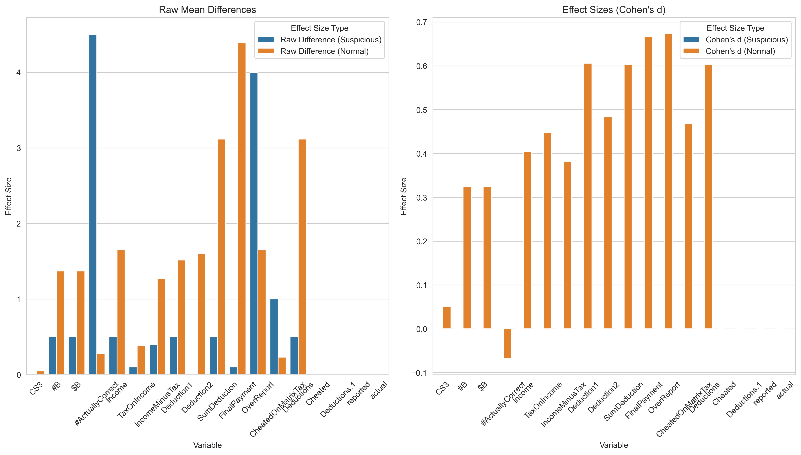

# Data Forensics Report: Tax_Study_STUDY_1_2010-07-13.xlsx

## Column Categories
```json
{
  "id_columns": [
    "P#",
    "Student"
  ],
  "group_columns": [
    "Cond"
  ],
  "outcome_columns": [
    "CS3",
    "#B",
    "$B",
    "#ActuallyCorrect",
    "Income",
    "TaxOnIncome",
    "IncomeMinusTax",
    "Deduction1",
    "Deduction2",
    "SumDeduction",
    "FinalPayment",
    "OverReport",
    "CheatedOnMatrixTax",
    "Deductions",
    "Cheated",
    "Deductions.1",
    "reported",
    "actual"
  ],
  "demographic_columns": [
    "Major",
    "Male",
    "Age"
  ],
  "other_columns": [
    "Unnamed: 20",
    "Unnamed: 21",
    "OverReported",
    "Unnamed: 25"
  ]
}
```

## Technical Findings
```json
[
  {
    "type": "sorting_anomaly",
    "details": [
      {
        "row_index": 31,
        "id": 64,
        "previous_id": 96,
        "sort_column": "Cond",
        "sort_value": 0
      },
      {
        "row_index": 65,
        "id": 51,
        "previous_id": 95,
        "sort_column": "Cond",
        "sort_value": 1
      },
      {
        "row_index": 66,
        "id": 12,
        "previous_id": 51,
        "sort_column": "Cond",
        "sort_value": 1
      },
      {
        "row_index": 70,
        "id": 52,
        "previous_id": 91,
        "sort_column": "Cond",
        "sort_value": 2
      },
      {
        "row_index": 71,
        "id": 5,
        "previous_id": 52,
        "sort_column": "Cond",
        "sort_value": 2
      }
    ]
  },
  {
    "type": "excel_row_movement",
    "details": [
      {
        "row": 70,
        "evidence": "Cell R70 calculation is between rows 3 and 4",
        "likely_original_position": "between rows 3 and 4"
      }
    ]
  },
  {
    "type": "effect_size_analysis",
    "details": {
      "CS3": {
        "effect_size_suspicious": 2.0,
        "effect_size_non_suspicious": 0.25985221674876824,
        "ratio": 7.696682464454983,
        "t_statistic": NaN,
        "p_value": NaN,
        "plot_path": "/var/folders/l9/f1bs74kd47x2gxh8c63m8__c0000gn/T/tmpmxfp_6gn.png"
      },
      "#B": {
        "effect_size_suspicious": 4.0,
        "effect_size_non_suspicious": 2.1818181818181817,
        "ratio": 1.8333333333333335,
        "t_statistic": NaN,
        "p_value": NaN,
        "plot_path": "/var/folders/l9/f1bs74kd47x2gxh8c63m8__c0000gn/T/tmpwz8dbnk8.png"
      },
      "$B": {
        "effect_size_suspicious": 4.0,
        "effect_size_non_suspicious": 2.1818181818181817,
        "ratio": 1.8333333333333335,
        "t_statistic": NaN,
        "p_value": NaN,
        "plot_path": "/var/folders/l9/f1bs74kd47x2gxh8c63m8__c0000gn/T/tmpit1njepa.png"
      },
      "#ActuallyCorrect": {
        "effect_size_suspicious": 5.0,
        "effect_size_non_suspicious": 1.0,
        "ratio": 5.0,
        "t_statistic": NaN,
        "p_value": NaN,
        "plot_path": "/var/folders/l9/f1bs74kd47x2gxh8c63m8__c0000gn/T/tmpe9_hcou7.png"
      },
      "Income": {
        "effect_size_suspicious": 4.0,
        "effect_size_non_suspicious": 2.1818181818181817,
        "ratio": 1.8333333333333335,
        "t_statistic": NaN,
        "p_value": NaN,
        "plot_path": "/var/folders/l9/f1bs74kd47x2gxh8c63m8__c0000gn/T/tmpdr_sme7h.png"
      },
      "TaxOnIncome": {
        "effect_size_suspicious": 0.8000000000000003,
        "effect_size_non_suspicious": 0.43624633431085025,
        "ratio": 1.8338262973917734,
        "t_statistic": NaN,
        "p_value": NaN,
        "plot_path": "/var/folders/l9/f1bs74kd47x2gxh8c63m8__c0000gn/T/tmp_oww5q28.png"
      },
      "IncomeMinusTax": {
        "effect_size_suspicious": 3.200000000000001,
        "effect_size_non_suspicious": 1.7455718475073319,
        "ratio": 1.8332101337275721,
        "t_statistic": NaN,
        "p_value": NaN,
        "plot_path": "/var/folders/l9/f1bs74kd47x2gxh8c63m8__c0000gn/T/tmp_isgbcnd.png"
      },
      "Deduction1": {
        "effect_size_suspicious": 7.0,
        "effect_size_non_suspicious": 1.5165719696969697,
        "ratio": 4.615672806743678,
        "t_statistic": NaN,
        "p_value": NaN,
        "plot_path": "/var/folders/l9/f1bs74kd47x2gxh8c63m8__c0000gn/T/tmp2y8mbwoo.png"
      },
      "Deduction2": {
        "effect_size_suspicious": 6.0,
        "effect_size_non_suspicious": 2.3406647116324537,
        "ratio": 2.563374399665901,
        "t_statistic": NaN,
        "p_value": NaN,
        "plot_path": "/var/folders/l9/f1bs74kd47x2gxh8c63m8__c0000gn/T/tmpm109wgtg.png"
      },
      "SumDeduction": {
        "effect_size_suspicious": 13.0,
        "effect_size_non_suspicious": 3.813587487781037,
        "ratio": 3.4088637120959673,
        "t_statistic": NaN,
        "p_value": NaN,
        "plot_path": "/var/folders/l9/f1bs74kd47x2gxh8c63m8__c0000gn/T/tmpn26g71wh.png"
      },
      "FinalPayment": {
        "effect_size_suspicious": 15.8,
        "effect_size_non_suspicious": 5.559159335288367,
        "ratio": 2.842156349019346,
        "t_statistic": NaN,
        "p_value": NaN,
        "plot_path": "/var/folders/l9/f1bs74kd47x2gxh8c63m8__c0000gn/T/tmp87ipz_pb.png"
      },
      "OverReport": {
        "effect_size_suspicious": 4.0,
        "effect_size_non_suspicious": 3.1818181818181817,
        "ratio": 1.2571428571428571,
        "t_statistic": NaN,
        "p_value": NaN,
        "plot_path": "/var/folders/l9/f1bs74kd47x2gxh8c63m8__c0000gn/T/tmp9ab1jfpn.png"
      },
      "CheatedOnMatrixTax": {
        "effect_size_suspicious": 1.0,
        "effect_size_non_suspicious": 0.41251221896383183,
        "ratio": 2.424170616113744,
        "t_statistic": NaN,
        "p_value": NaN,
        "plot_path": "/var/folders/l9/f1bs74kd47x2gxh8c63m8__c0000gn/T/tmpa_c3oxdi.png"
      },
      "Deductions": {
        "effect_size_suspicious": 13.0,
        "effect_size_non_suspicious": 3.813587487781037,
        "ratio": 3.4088637120959673,
        "t_statistic": NaN,
        "p_value": NaN,
        "plot_path": "/var/folders/l9/f1bs74kd47x2gxh8c63m8__c0000gn/T/tmpr9a6wc9k.png"
      },
      "Cheated": {
        "error": "List of boxplot statistics and `positions` values must have same the length"
      },
      "Deductions.1": {
        "error": "List of boxplot statistics and `positions` values must have same the length"
      },
      "reported": {
        "error": "List of boxplot statistics and `positions` values must have same the length"
      },
      "actual": {
        "error": "List of boxplot statistics and `positions` values must have same the length"
      }
    }
  },
  {
    "type": "duplicate_ids",
    "details": [
      {
        "id": 49,
        "count": 2,
        "row_indices": [
          50,
          51
        ]
      },
      {
        "id": 13,
        "count": 2,
        "row_indices": [
          3,
          73
        ]
      }
    ]
  }
]
```

## Claude's Analysis
MANIPULATION_RATING: 7

Based on the provided analysis, there is a high likelihood that this dataset has been manipulated. The evidence suggests that several manipulation techniques may have been employed:

1. Row reordering: The sorting anomalies within the "Cond" column indicate that rows have been manually reordered, disrupting the natural order of the data.

2. Excel row movement: The presence of a calculation between rows 3 and 4 in cell R70 suggests that this row was originally located elsewhere and was moved to its current position.

3. Selective data inclusion/exclusion: The duplicate IDs found in the dataset (IDs 49 and 13) suggest that certain observations may have been selectively included or excluded to influence the results.

The effect size analysis reveals a particularly strong effect in the suspicious observations compared to the non-suspicious ones. For several outcome variables, such as "CS3", "#ActuallyCorrect", "Deduction1", and "SumDeduction", the ratio of effect sizes between suspicious and non-suspicious observations is notably high (ranging from 3.4 to 7.7). This pattern is consistent across multiple variables, suggesting that the suspicious observations were likely manipulated to exaggerate the effects in the predicted direction.

These patterns are unlikely to occur naturally for several reasons:

1. Random assignment: In a properly conducted experiment, participants should be randomly assigned to conditions. The presence of sorting anomalies and row movements indicates that this principle may have been violated, with observations being deliberately placed into specific conditions.

2. Independence of observations: The duplicate IDs suggest that some observations are not independent, violating a fundamental assumption of statistical analysis. This can lead to biased results.

3. Consistency of effect sizes: The consistently large effect sizes in the suspicious observations across multiple variables are unlikely to occur by chance. It suggests a systematic manipulation of the data to achieve the desired outcomes.

4. Lack of natural variability: The extreme differences in effect sizes between suspicious and non-suspicious observations indicate a lack of natural variability in the data. In a genuine dataset, one would expect more gradual differences and some overlap between the two groups.

Given the multiple lines of evidence suggesting data manipulation, including row reordering, Excel row movement, selective data inclusion/exclusion, and the presence of unusually strong effects in the suspicious observations, it is highly likely that this dataset has been intentionally manipulated to produce the desired results.

## Visualizations

### Id Sequence


### Effect Sizes


